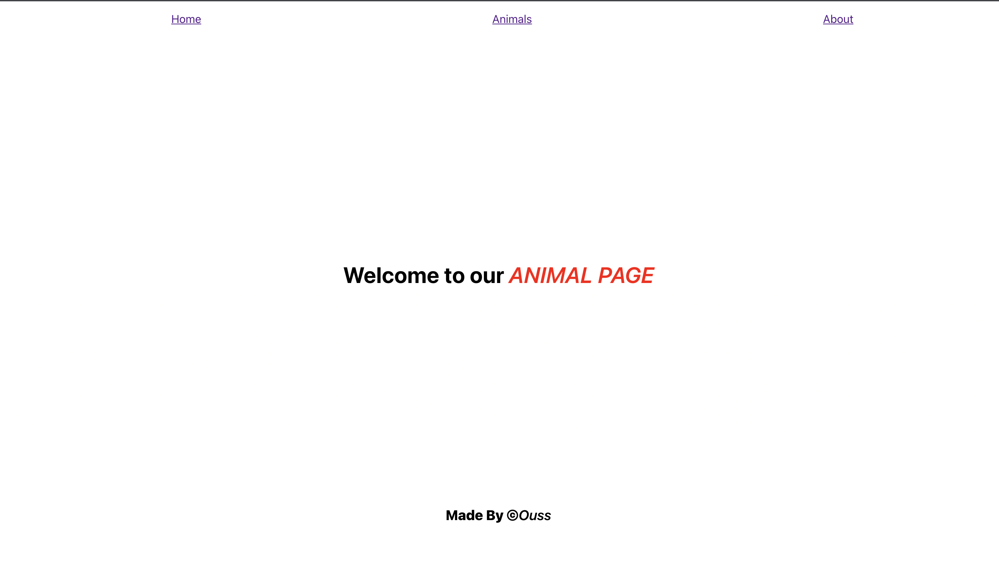
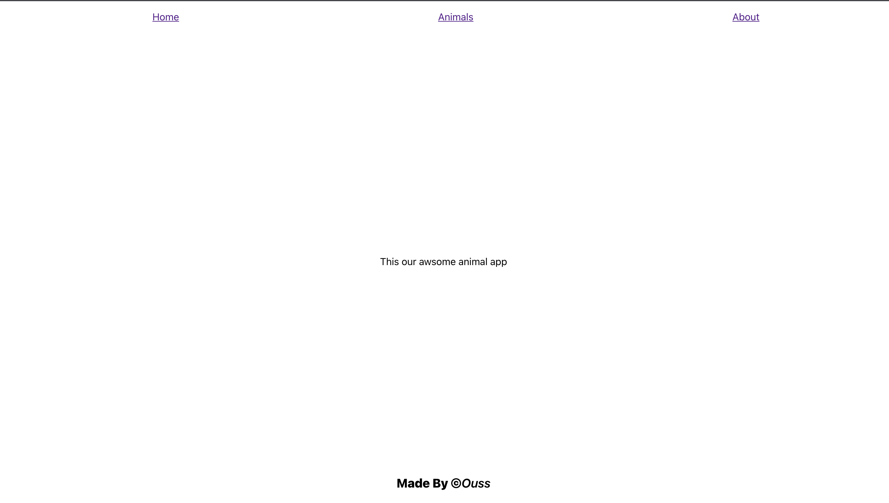
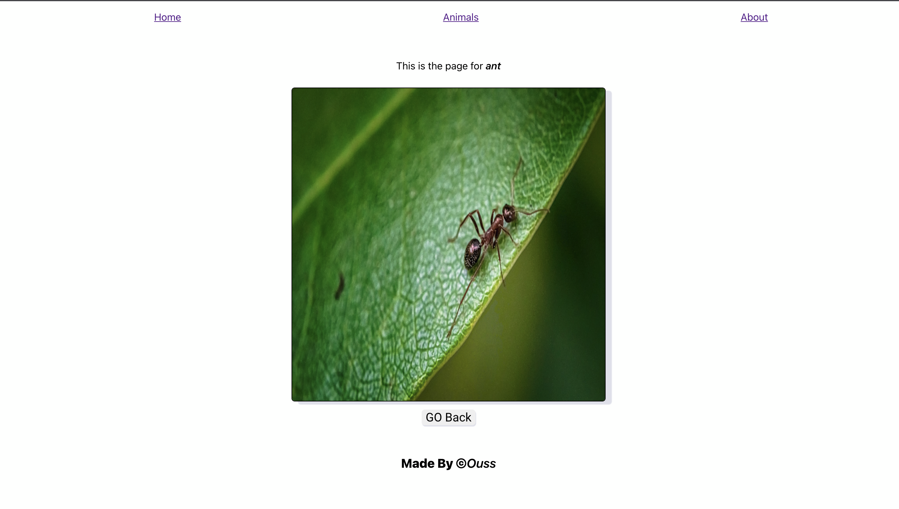

# Animal list and search app

## Description

- An react application that retrieve all the animals from a "local data file" and display them in an alphabetically order.
- Using React-Router-DOM to navigate the links.
- Adding the search fonctionality to filter the animal list.

## Application screenshots

